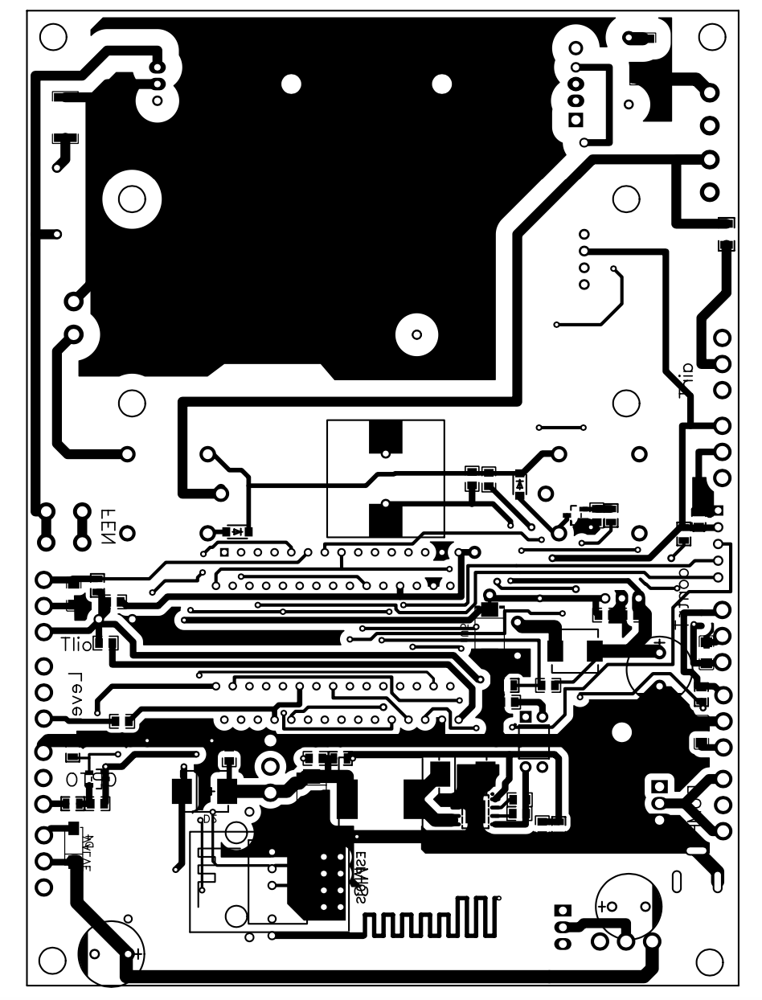

## Project Description

### Schematic and PCB Layout

I have provided schematics and PCB layouts in a printable format for firmware version 1.33. These can be presented as a comprehensive project.

[^1]
[^2]
[^3]
[^4]

### Compatible Boards

You can use either an Arduino Nano (or the new Chinese equivalent LGT328p) or an ESP32 on the board, as shown in the provided sketch. If you choose the latter, you can replace SMS notifications with Wi-Fi and continue the project's development.

### Display Options

The display can be either an old two-line display or any other with an I2C interface, such as a 0.96 OLED.

### Support and Questions

For any questions regarding the schematic or PCB layout, feel free to raise them as needed. We can address and resolve them as they come up.

### Best Wishes

Wishing you creative success in your endeavors!

Best regards,
Nikolay Lobanov

[^1]: [Burner 1 PDF](burner-1.pdf)
[^2]: [Burner 2 PDF](burner-2.pdf)
[^3]: [Burner 3 PDF](burner-3.pdf)
[^4]: [Burner 4 PDF](burner-4.pdf)

